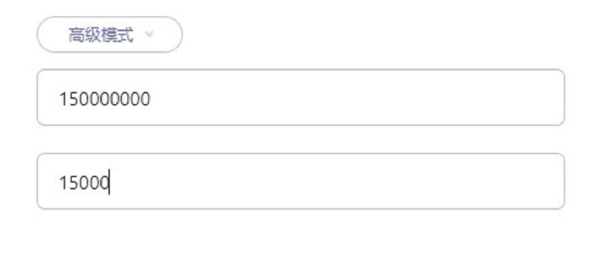
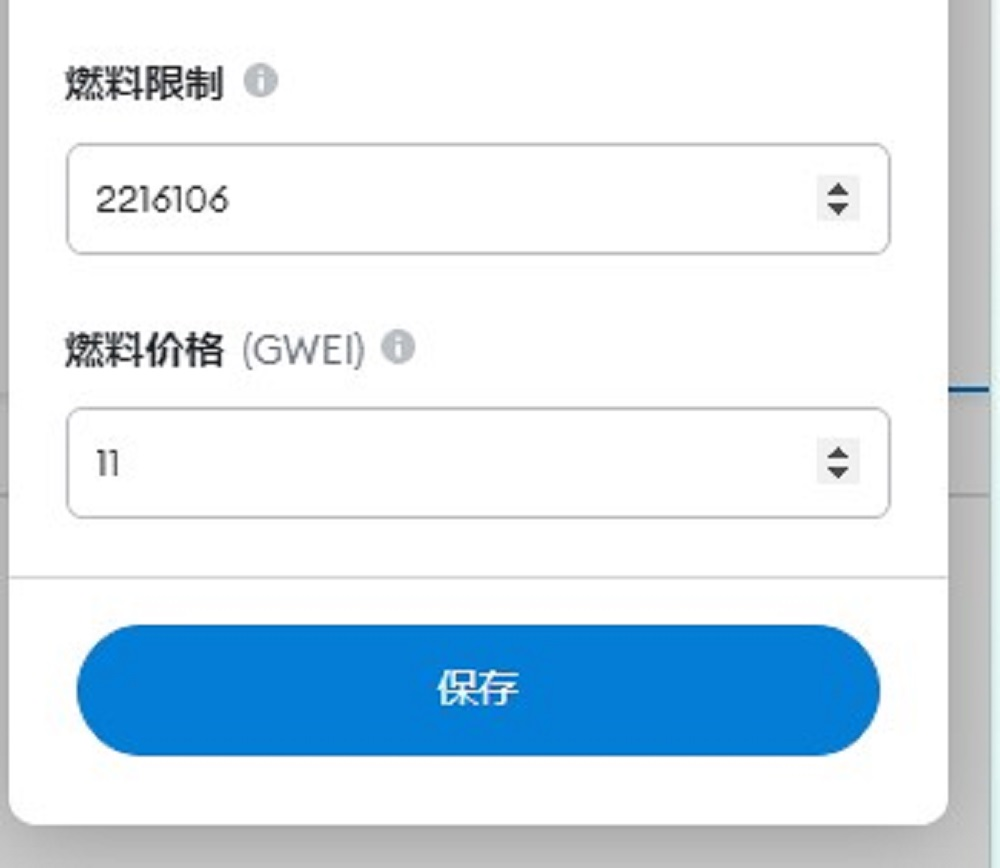

# Gas设置

当区块链拥堵时，需要提高 Fee 来获得优先权来尽快达成交易。以下介绍如何设置 GAS 来实现。

操作分两部分，Oasis 主网与 Emerald 互转、Emerald 内部操作

**声明：本文中的建议，为依据撰文时的链上情况做出的判断，用户请根据此方法自行尝试更合适的参数。**

## 一、Oasis 主网与 Emerald 互转

此操作在 Chrome 插件钱包内，具体使用方式可参照[Oasis与Emerald之间的ROSE划转](dev-oasis-china/dev_support/Oasis与Emerald之间的ROSE划转/Oasis与Emerald之间的ROSE划转.md).

在下图中，手动填入 **Fee Amount** 及 **Fee Gas**，建议 150000000/15000 。

> 此参数总费用上限为 0.15 ROSE，数值仅供参考，如持续拥堵，可修改 15000 为更大的数值.

> 目前非拥堵时段，如使用默认参数，总费用预计小于 0.001 ROSE。

## 二、Emerald内部操作

可在 MetaMask 钱包内的“活动”标签中，找到进行中的交易，点击“加速”

调整"燃料价格（GWEI）",一般默认为10左右，建议调整为30

## 三、GAS 计算方式

### 3.1、Oasis主网

Oasis主网内部操作，以及 Oasis 和 Emerald 的交互，均按照 Oasis 主网的设计来进行。

可设置参数：

- Fee Amount：数量单位，可支付的费用总数，单位为 nano ROSE（0.000000001 ROSE ),最低 21000
- Fee Gas：数量单位，一次执行可以使用的最大gas。如 Gas 数量不足，会导致失败且费用不退

可计算得出：

- Gas Price：Amount / Gas。如 Price 过低，节点会拒绝交易，且费用不退。

### 3.2、Emerald

Emerald 使用的与以太坊 Ethereum 同样的 Gas 机制（此处燃料为 ROSE ）

- Gas Limit：数量单位，想付出的总 gas 的个数
- Gas Price：数量单位，每个 gas 对应几个 GWEI
- Gwei：数量单位，1Gwei = 1 nano ROSE（0.000000001 ROSE )

最终成本：

- 实际消耗的Gas（个） * Gas Price（个） = Gwei（个），再转换成 ROSE 数量

如有疑问或错漏，请在[官方群](https://t.me/oasisnetworkchina)里反馈。
  > 作者：moi 2022/03/18

  > 最新编辑：moi 2022/03/18