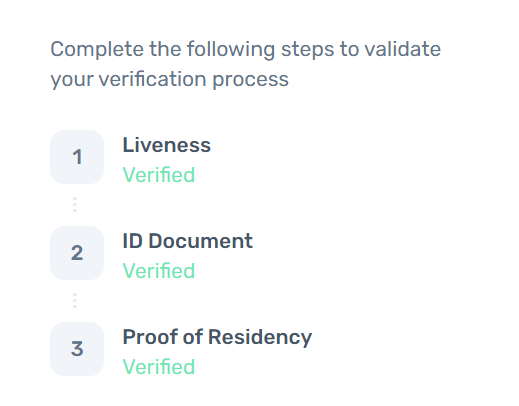

# Oasis KYC 教程

## 一、背景

当参加一些Oasis官方活动时，要求要完成KYC认证，这里出一份教程避免大家踩坑。

## 二、注册账号

1. 登陆网址 [https://oasis-network-individual.synaps.io/login?returnUrl=%2F](https://oasis-network-individual.synaps.io/login?returnUrl=%2F)&#x20;
2. 点击 `Create your free account` 按钮进行注册\
   .png>)
3. 填写必要的信息，点击 `Create` 按钮创建账号
4. 填入邮箱验证码，点击 `Confirm` 确认。
5. 接下来会等待Oasis Network去验证你的请求。这个过程大约需要1\~2天。\
   .png>)

## 三、认证过程

> 注意：该过程请在移动端操作，否则可能无法时候摄像头等设备。如果显示 `pending` 就说明需要等人审核，耐心呆一会就好了

此过程分为三个步骤，分别是：人脸认证、身份认证、居住认证。

.png>)

### 1. 人脸认证

> 按要求操作就好了，一般不都不会在这步骤出现问题

### 2. 身份认证

这个步骤可以通过护照和身份证，这里以身份证（\[National ID]）为例。

选择 `China`，选择 `National ID` ，  然后上传身份证的正反面两张照片。

.png>)

> 注意：上传的身份证分为正面和反面，我传的时候没注意导致重新传了好多次。

### 3. 居住认证

这个步骤问题很多，一般都会出错，<mark style="color:red;">**这也就是本教程出现的意义**</mark>。

> 注意，账单需满足三个条件：
> * 需包含姓名、住址的个人信息
> * 需体现你的消费记录凭证，如水电费、京东账单、打车发票（包含住址的个人发票）
> * 账单有效期为三个月以内

* 如果有三个月内的水费、电费账单，那么按要求选择对应的 `electricity bill` 或 `water bill` 正常操作即可
* 有些小伙伴由于某些原因没有上面提到的账单信息。那么也可以通过其他方式验证居住认证的。如京东订单截图，或者滴滴打车美团打车个人发票，申请发票的时候填好自己的住址就好了（我用的是打车发票）。
  > 这里要选 `bank bill` !，我选择`internet bill` ，就会出错。

## 四、最后

当三个步骤都为 `Verified` 即表示KYC成功了。

> 作者：evan 

> 最后更新：2022/03/26
