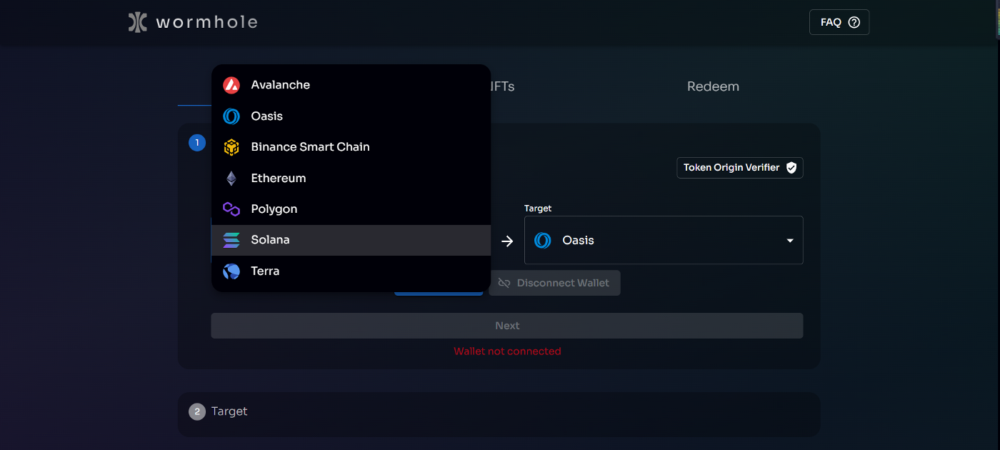
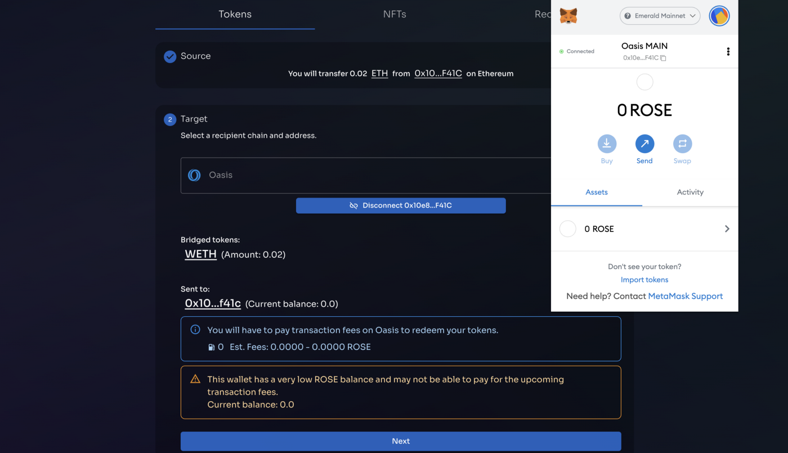
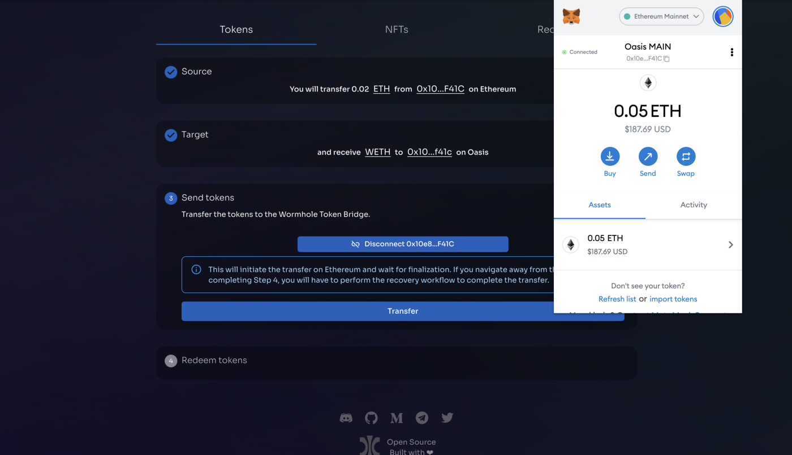
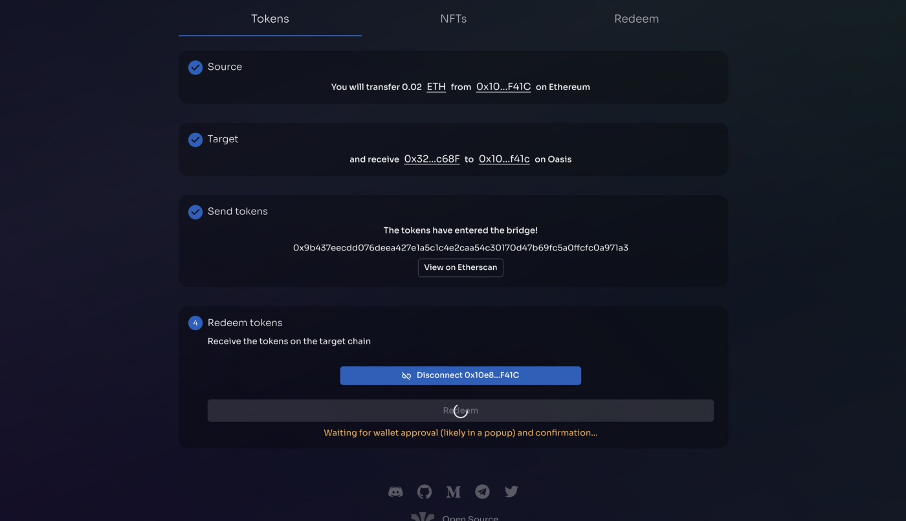

[官网](https://wormholebridge.com/) / [跨链桥](https://portalbridge.com/#/transfer)

2021年12月7日，Oasis很高兴地宣布与WormHoleCrypto 建立合作伙伴关系，未来通过整合Wormhole Bridge，Oasis网络上的DeFi用户和开发者可以在各大去中心化网络之间实现资产的自由流通。

通过与Wormhole Bridge的合作，Oasis网络上的DeFi用户和开发者可以在诸如Avalanche、BSC、Terra、Ethereum、Polygon、Solana等各大去中心化网络之间实现资产的自由流通。

[Wormhole跨链操作](https://medium.com/@OasisNetworkCN/yuzuswap%E6%93%8D%E4%BD%9C%E6%95%99%E7%A8%8B-oasis%E7%94%9F%E6%80%81%E9%A6%96%E4%B8%AAdex%E4%B8%8A%E7%BA%BF-%E8%B5%A2%E5%8F%96%E4%B8%B0%E5%AF%8C%E5%A5%96%E5%8A%B1-9cb5fbbfe112) -- 摘自Oasis官方 Medium

1、打开跨链桥

打开https://wormholebridge.com/，进入跨链桥页面。

选择你的资产来源链，目标链选择Oasis，确定好链后可以选择想要跨链的Token，点击NEXT。

2、确认交易信息。

这需要一些ROSE做为gas费用（可以通过上面的CEX转入ROSE），确认之后点击NEXT。

3、发送代币。

点击Transfer，回到Ethereum，点击确认。

4、点击Redeem 即可在Oasis主网领取已跨链的资产。

