# GemKeeper——去中心化交易所 & Defi平台

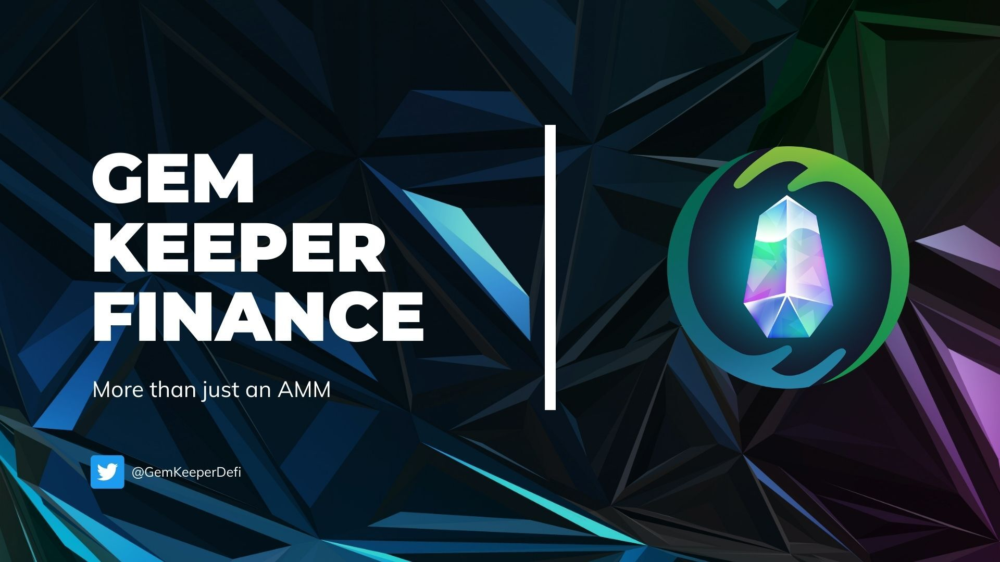

### GemKeeper介绍
**GemKeeper**是一个基于Oasis的AMM & DeFi平台。我们的愿景是建立一个一站式的平台来满足我们用户的任何DeFi需求。GemKeeper令牌BLING将是GemKeeper旗下所有产品的基石。

**GemKeeper**由PeckShield审计([报告](https://github.com/GemKeeperDEV/GemKeeperFinance/blob/main/PeckShield-Audit-Report-GemKeeper-v1.0.pdf)) ，由0xDiamond和Azer创立于2022年1月

GemKeeper诞生的初衷是为了解决DeFi所面临的问题，并创造一些独特和创新的东西，与绿洲网络及其社区的出现产生共鸣。

### GemKeeper功能
- Swap（交换）

在我们的游戏化平台上与我们的自动做市商(AMM)交易所进行无缝交易

- Yield Farming（收益农场）

持有LP代币进入农场，并获得$BLING作为回报

- Bridge（跨链桥）

跨链桥由MultiChain、Wormhole提供支持

   
桥|LP
--|:-
Wormhole | USDT/ROSE
Wormhole | USDT/ Multichain- USDC
Multichain | BUSD/ROSE
Multichain | LINK/ROSE
Multichain | USDC/ROSE
Multichain | BNB/ROSE

- Zap

该功能提供从单币种到 LP 的快捷兑换

- 即将到来的新特性

我们计划在GemKeeper的旗下添加更多的产品和功能，敬请关注我们的公告

### 挖矿
这里以 wROSE-USDC 为例，共需要以下步骤

- 获取 wROSE、USDC
- 添加 wROSE-USDC 流动性
- 质押 wROSE-USDC LP 到农场
- 收获 流动性收益
- 解除 wROSE-USDC LP 质押
- 移除 wROSE-USDC LP

#### 1.获取 wROSE、USDC
我们可以通过将部分 ROSE 通过DEX功能转换为 wROSE，再将部分 ROSE 转换为USDC，至于如何将ROSE存入钱包中，请参考 [Oasis与Emerald之间的ROSE划转](https://dev-oasis-cn.gitbook.io/support/ji-shu-zhi-chi/oasis-yu-emerald-zhi-jian-de-rose-hua-zhuan)

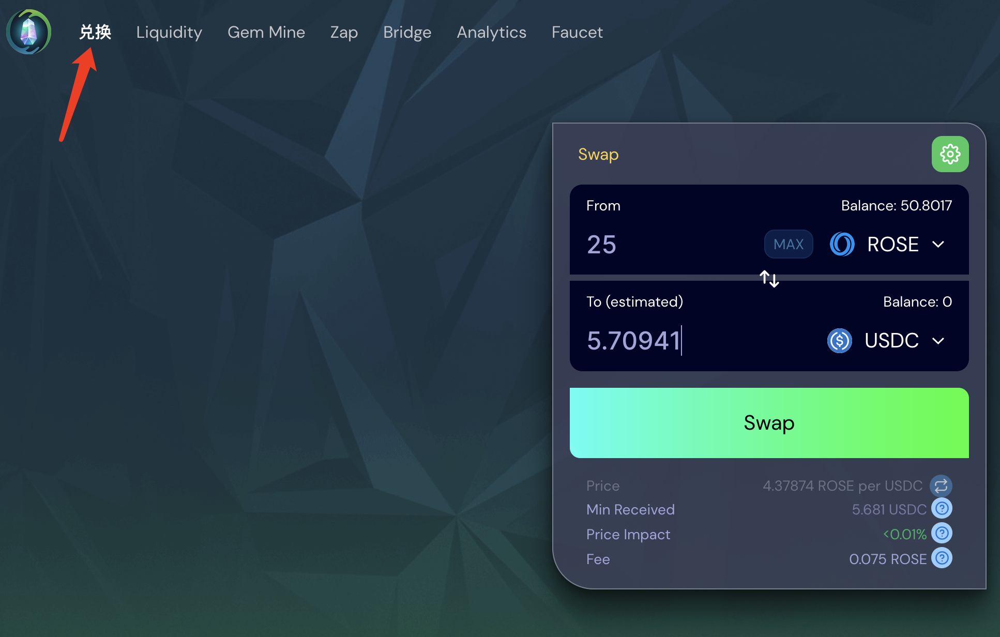

#### 2.添加 wROSE-USDC LP
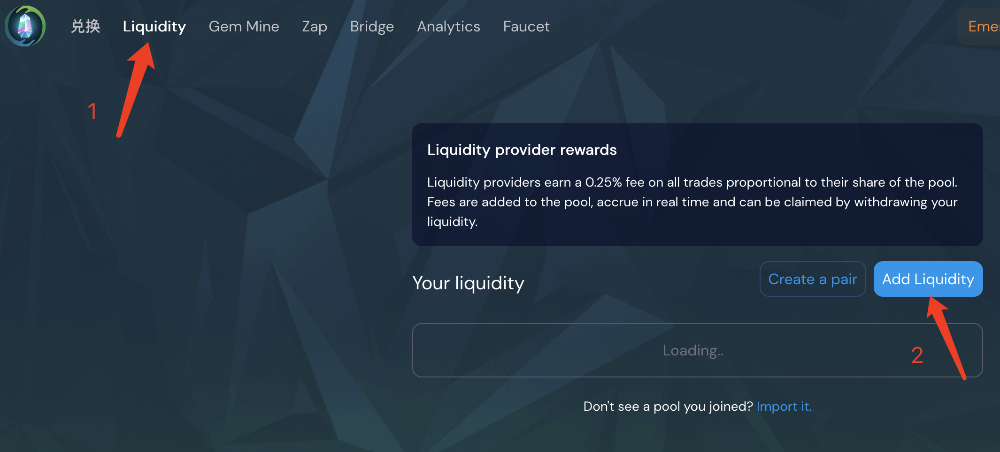

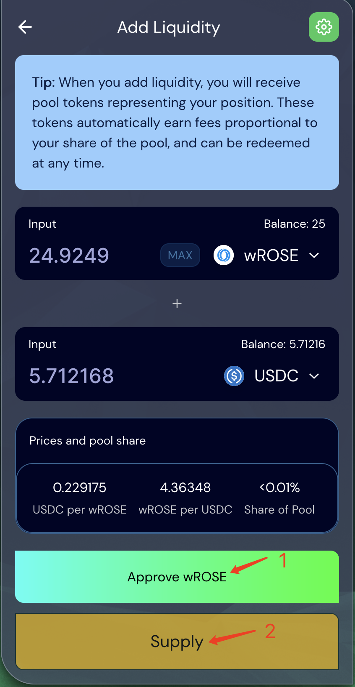

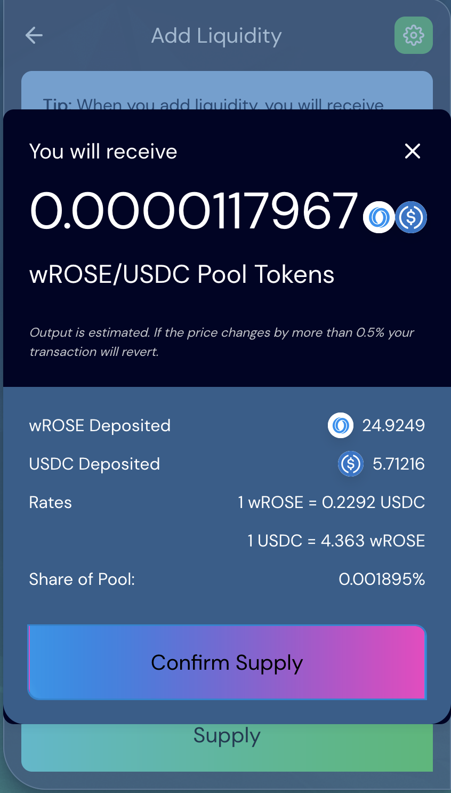

这里点击 Confirm Supply ，在钱包中点击确认即可添加成功，如果执行慢可以提高gas fee进行加速

#### 3.质押 wROSE-USDC LP 到农场
经过上一步的添加LP，可以切换到 Liquidity 中看到如图所示

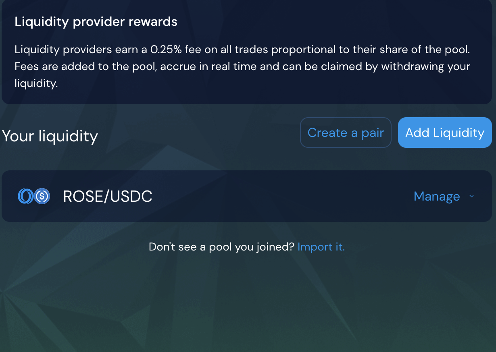

下面将该LP质押到农场来赚取收益，如图所示

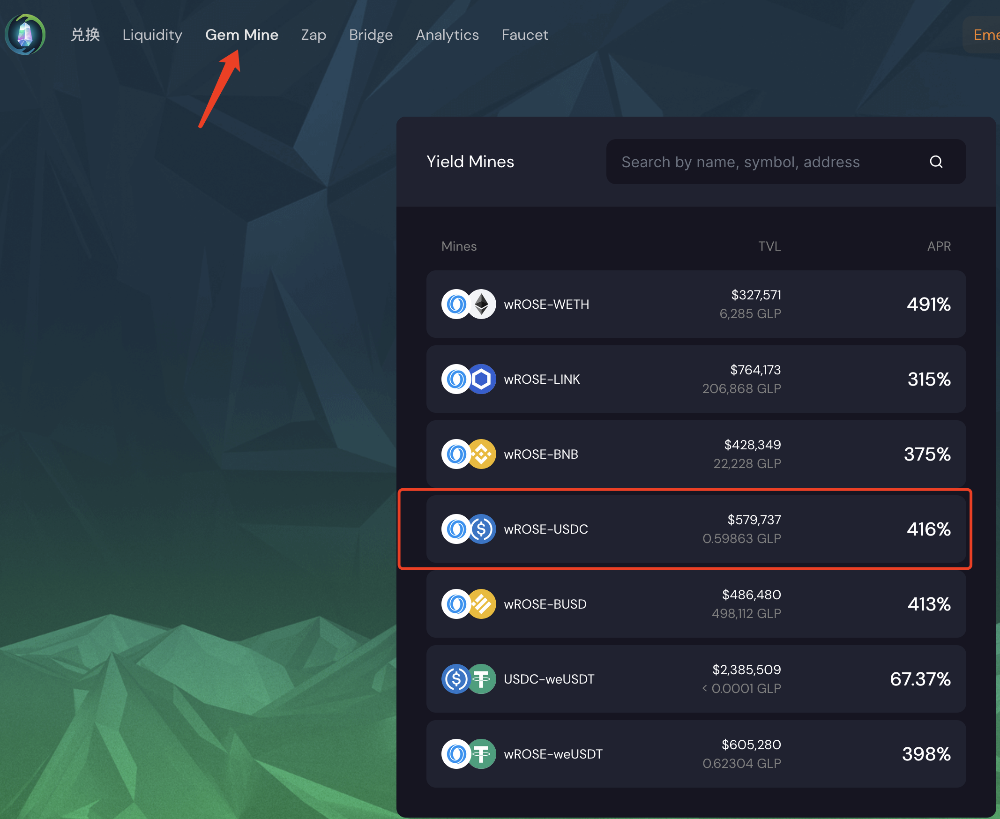

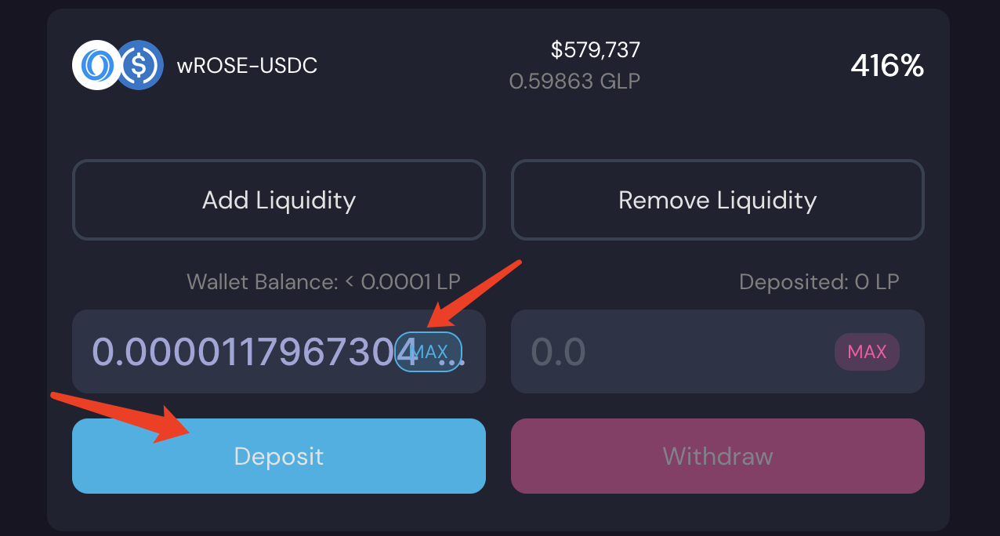

在左侧输入框点击MAX，然后点击Deposit存入，钱包确认即可成功，同理，提取点击Withdraw

#### 4.收获 流动性收益

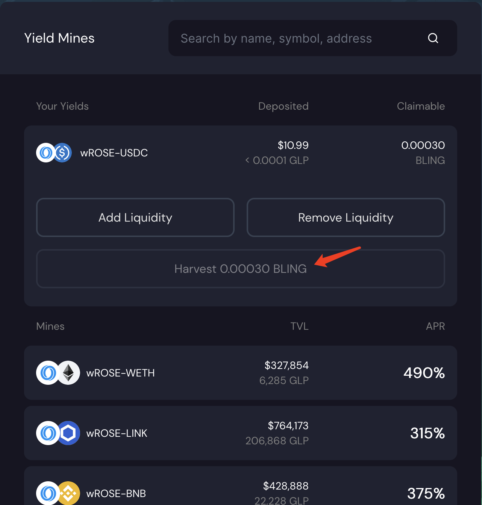

#### 5.解除 wROSE-USDC LP 质押

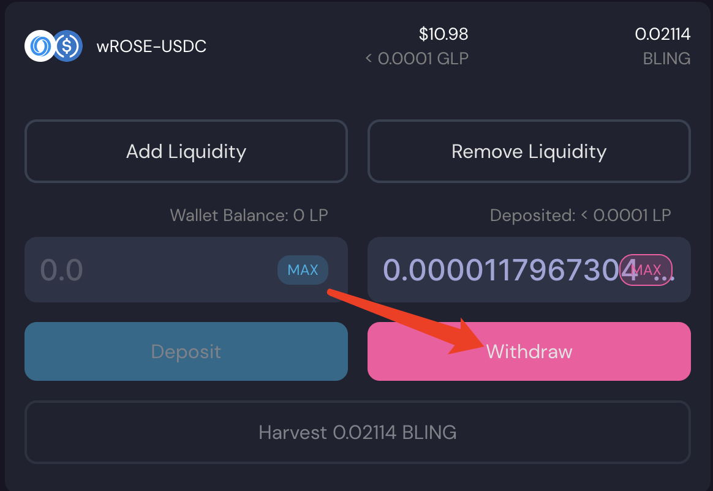

#### 6.移除 wROSE-USDC LP

首先切换到 Liquidity

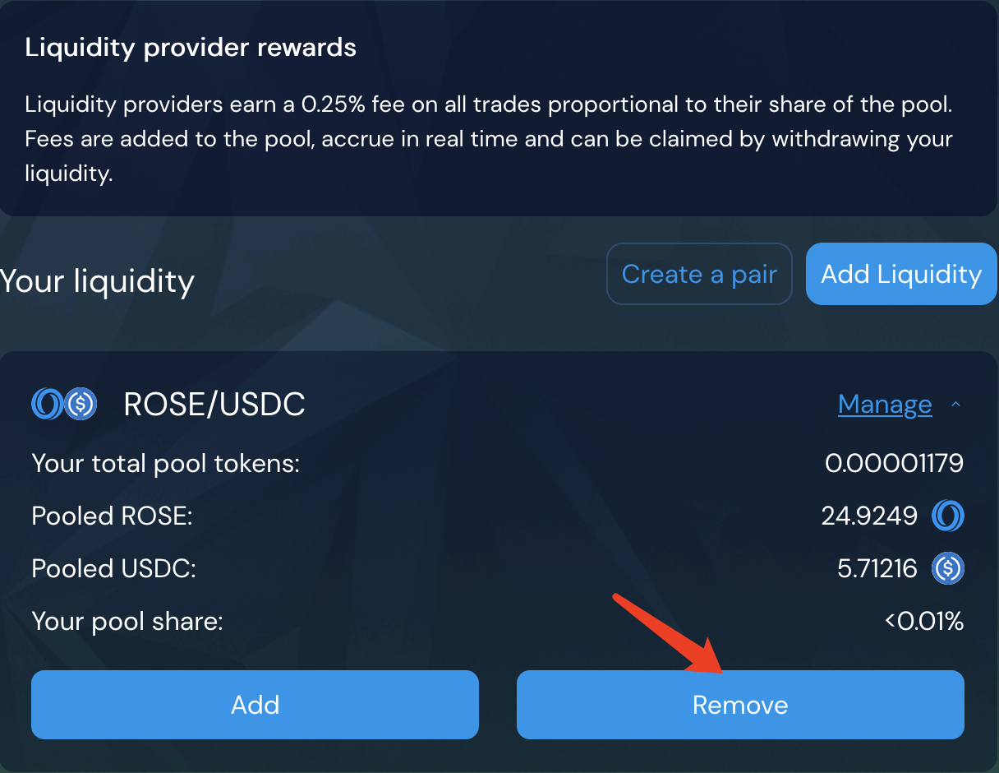

移除成功后会钱包会收到一定数量的 wROSE 和 USDC

### 代币合约地址
BLING：未上线

### 相关社交链接
[Telegram](https://t.me/GemKeeperAnnouncements)

[Twitter](https://twitter.com/GemKeeperDeFi)

[Discord](https://discord.com/invite/Jcbj5E9Ysd)

[GemKeeper官网](https://app.gemkeeper.finance)

[GemKeeper博客](https://gemkeeperdefi.medium.com/)

[更多细节参考-英文文档](https://gemkeeper-finance.gitbook.io/docs/welcome/introduction)

> 作者：胜军哥

> 更新时间：2022/3/19
