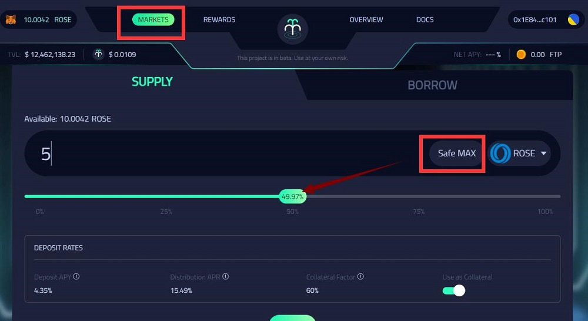
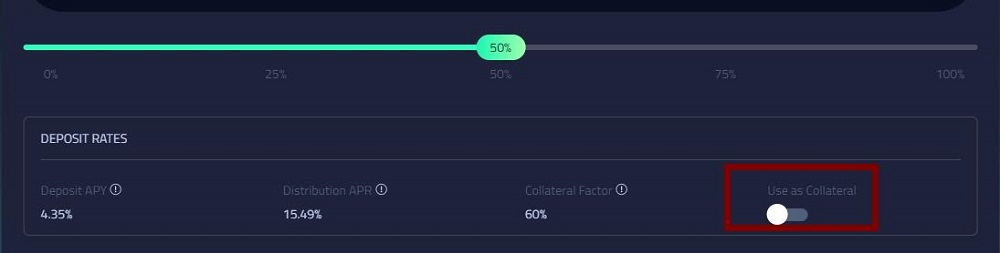
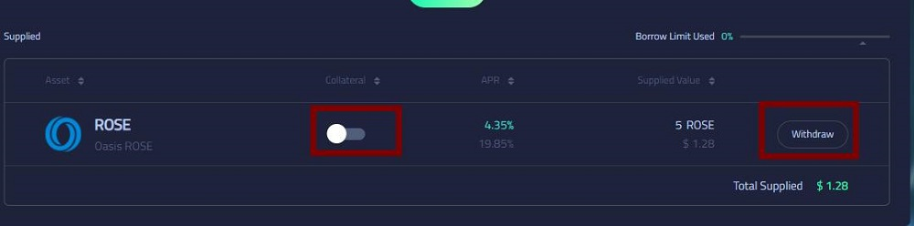
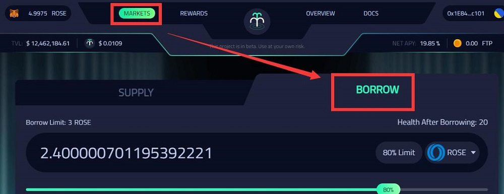
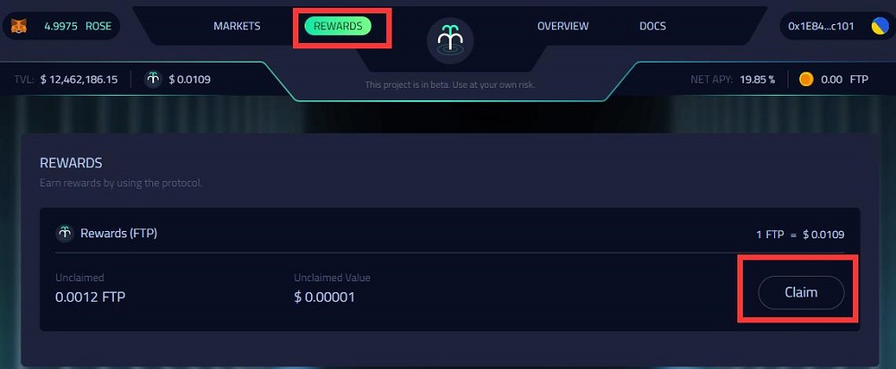

# 喷泉协议-去中心化跨链借贷平台

喷泉协议 **Fountain Protocol** 是第一个由 Oasis 提供支持的去中心化跨链借贷平台，该协议使用户能够体验高资本效率，具有杠杆交易、跨链借贷的特点。用户可以在平台上存入、借入资产并赚取利息，借款人以超额抵押的方式借款，存款人为协议提供流动性来获得被动收益。

喷泉协议由PeckShield和Verilog团队审计([报告](https://github.com/dev-fountain/fountain-protocol-audit))，并于 2022/02/28 正式上线 Emerald。

## 操作指南

- 存入资产，获得利息(存入后转化为有息代币fToken)
- 抵押“已存入的”资产，借入所需资产代币
- 质押FTP，获得利息
- 在YuzuSwap上为FTP-ROSE交易对提供流动性来获得收益
> fToken为基础资产的计息版本，当向Fountain Protocol的各个市场提供代币时，相应的fToken会被铸造并由供应商的钱包接收(例如ROSE mints fROSE)。每当用户铸造、赎回、借入、偿还或清算账户时，他们都是通过与相关fToken合约的交互来实现的。

### 一、存入资产

1. #### 准备代币

   代币可以为ROSE(由主网转入Emerald，或者通过YuzuSwap交易获得)、ETH\USDT\USDC(Womehole跨链桥转入)，需注意保持一定数量的ROSE作为gas。跨链后的[代币合约地址](#wu-dai-bi-he-yue-di-zhi)见文末。

2. #### 连接 MetaMask 钱包

   添加Emerald RPC

   ```
   Network Name: Emerald Mainnet
   RPC URL: https://emerald.oasis.dev
   Chain ID: 42262
   Symbol: ROSE
   ```

   在Fountain Protocol[官网](https://ftp.cash/dashboard/markets)右上角连接钱包。

3. #### 存入资产

   此处以ROSE为例，在顶栏中选择**Markets**标签页，下方选择**SUPPLY**标签页，选择对应的代币数量，点击下方 SUPPLY按钮，经过MetaMask钱包授权、交易后，完成存入。

   - 可以自己选择“安全”比例来方便的进入代币数量的输入
   
   - 可以在存入时，选择是否直接当作抵押品(如果此处不抵押，可以借入操作时再处理)
   
   - 如果是第一次操作，需进行授权、交易共两步
   

   

   
   


### 二、抵押借入

1. #### 抵押

   存入后，可在当前界面查看已存入的资产状况，如下图，左侧红框可以将已存入的资产进行抵押，右侧可提取出**未抵押**的资产。
   

   
   点击质押按钮后，经钱包确认后即完成质押。
   
2. #### 借入、还款

   切换到**MARKETS**下的**BORROW**，可依据“超额抵押”原则借入指定的代币。



   完成交易后，可在钱包内查看到已借到的代币(代币合约地址在文末)。

   同样，在下方可以看到已借入的代币，点击**Repay**完成还款。

### 三、领取FTP收益

在顶栏中选择**REWARDS**标签页，点击**Claim**按钮，领取存入资产所产生的收益代币FTP。




## 其他信息

### 四、即将上线

- 投入FTP代币获得质押奖励
- 在YuzuSwap上为FTP-ROSE交易对提供流动性来获得收益
- 杠杆交易：通过增加一键杠杆的功能，提供借贷的交易场景，同时为交易者提供杠杆交易服务
- 跨链借贷：允许用户利用跨区块链的资产进行借贷活动

### 五、代币合约地址
通过Wormhole平台跨链的代币

```
ROSE：公链原生代币
FTP:0xd1dF9CE4b6159441D18BD6887dbd7320a8D52a05
USDT:0xdC19A122e268128B5eE20366299fc7b5b199C8e3
USDC:0xE8A638b3B7565Ee7c5eb9755E58552aFc87b94DD
ETH:0x3223f17957Ba502cbe71401D55A0DB26E5F7c68F
```
### 六、相关链接

- [Fountain Protocol推特@fountainprot](https://twitter.com/fountainprot)
- [Fountain Protocol官网](https://ftp.cash/home)

>作者：moi 2022/03/02
>最新编辑：White 2022/03/02